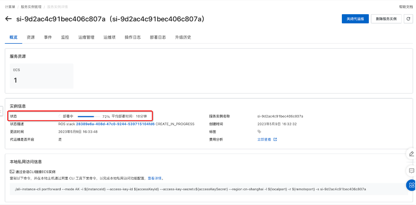
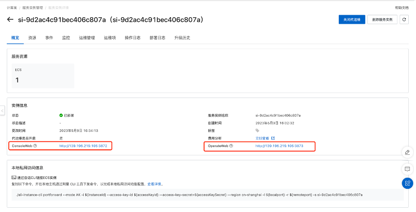
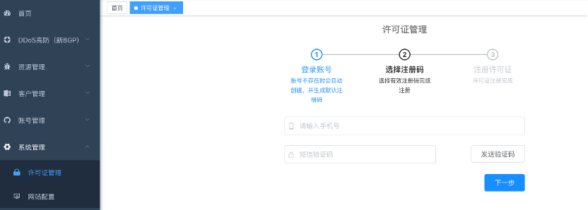

# OEMCloud云安全产品分销平台部署

>**免责声明：**本服务由第三方提供，我们尽力确保其安全性、准确性和可靠性，但无法保证其完全免于故障、中断、错误或攻击。因此，本公司在此声明：对于本服务的内容、准确性、完整性、可靠性、适用性以及及时性不作任何陈述、保证或承诺，不对您使用本服务所产生的任何直接或间接的损失或损害承担任何责任；对于因您使用本服务而产生的任何损失、损害，包括但不限于直接损失、间接损失、利润损失、商誉损失、数据损失或其他经济损失，不承担任何责任，即使本公司事先已被告知可能存在此类损失或损害的可能性；我们保留不时修改本声明的权利，因此请您在使用本服务前定期检查本声明。如果您对本声明或本服务存在任何问题或疑问，请联系我们。

## 概述

`感谢您选择OEMCloud云安全产品分销平台！本文档将向您介绍如何快速部署该平台。OEMCloud云安全产品分销平台是一款基于云计算的安全产品分销平台，提供了云安全产品的管理、监控、告警等功能，为企业客户提供全面的安全保障。同时您可以通过该平台对进行客户管理、云账号管理、安全产品实例管理。平台仅需2c/8G服务器即可轻松运行，且平台界面简单，易于操作。通过部署该平台，您可以轻松地向您的客户提供云安全产品与服务。`

## 计费说明

`OEMCloud云安全产品分销平台费用：正式版本为10,000元/年；试用版本0元/15天。ECS实例、网络流量等费用均为标准费用。`

## 部署架构

`OEMCloud云安全产品分销平台单机部署架构`

## RAM账号所需权限

服务需要对ECS、VPC等资源进行访问和创建操作，若您使用RAM用户创建服务实例，需要在创建服务实例前，对使用的RAM用户的账号添加相应资源的权限。添加RAM权限的详细操作，请参见[为RAM用户授权](https://help.aliyun.com/document_detail/121945.html)。所需权限如下表所示。

| 权限策略名称 | 备注 |
| --- | --- |
| AliyunECSFullAccess | 管理云服务器服务（ECS）的权限 |
| AliyunVPCFullAccess | 管理专有网络（VPC）的权限 |
| AliyunROSFullAccess | 管理资源编排服务（ROS）的权限 |
| AliyunComputeNestUserFullAccess | 管理计算巢服务（ComputeNest）的用户侧权限 |
| AliyunCloudMonitorFullAccess | 管理云监控（CloudMonitor）的权限 |

## 部署流程

### 部署步骤
1. 在[产品页面](https://market.aliyun.com/products/57004003/cmgj00062523.html?spm=5176.730005.result.12.38253524PmOkRo&innerSource=search_OEM#sku=yuncode5652300001)选择您想要购买的版本
 
    
   
2. 点击【立即购买】后，创建服务实例

    

3. 确认服务信息与订单信息，点击确认购买并支付

    
   
4. 支付完成后，即可在云市场已购买服务中看到我们，等待状态由开通中转为已开通，选择立即进入计算巢部署

    

5. 等待部署状态显示为已部署
   
    

6. 点击ConsoleWeb，即可跳转至产品页面
   
    

### 部署参数说明

| 参数组     | 参数项     | 示例             | 说明                                      |
|---------|---------|----------------|-----------------------------------------|
| 服务实例名称  |         | oemcloud-mp1x  | 实例的名称                                   |
| 地域      |         | 华东1（杭州）        | 选中服务实例的地域，建议就近选中，以获取更好的网络延时。            |
| 可用区配置   | 部署区域    | 可用区I           | 地域下的不同可用区域                              |
| 付费类型配置  | 付费类型    | 按量付费 或 包年包月    |
| ECS实例配置 | 实例类型    | ecs.gn6i-c4g1.xlarge | 实例规格，可以根据实际需求选择                         |
| ECS实例配置 | 实例密码    | ********       | 设置实例密码。长度8~30个字符，必须包含三项（大写字母、小写字母、数字、()`~!@#$%^&*-+={}[]:;'<>,.?/ 中的特殊符号） |
| 网络配置    | 专有网络VPC | vpc-******     | VPC实例ID                                 |
| 网络配置    | 交换机 | vsw-********   | 交换机实例ID                                 |

### 验证结果
您已打开OEMCloud云安全产品分销平台的大门 🥳 
   1. 首先登录“OEMCloud云巢”：
      1. 初始登录账号：admin，密码：OEMCloud2023；
      2. 进入后通过手机号进行账号授权；
      3. 左侧菜单-客户管理，创建客户（客户的公司名称）；
      4. 左侧菜单-账号管理-客户用户管理，创建客户用户（获取登录云台的账号与密码）。
   2. 通过在“OEMCloud云巢”内创建的用户信息登录“OEMCloud云台”

   
   
   
   

注意： 通过阿里云市场进入的试用部署，产品可以免费试用，但是云资源费用需要正常支付，到期后可以正常续费，数据不会丢失。
## 联系我们

如果您在安装或使用过程中，遇到任何问题，请发送邮件至 👉 support@shuyuninfo.com或商品详情页联系钉钉👉 【曙云全能小助手】 ，我们的工程师会及时解决您的问题。